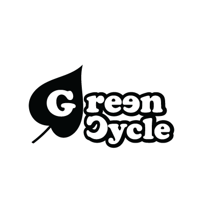
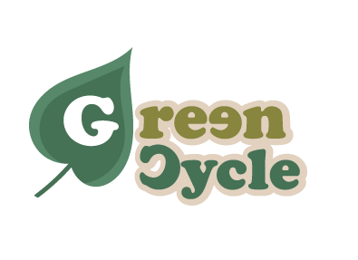

<p align="center">
  <!-- Graphic identifier for docs and GitHub -->
  
</p>

# GreenCycle

**GreenCycle** is a gamified web application where users manage a personal virtual greenhouse and a collection of digital trees.

Users can plant and view their own trees while the system progressively incorporates growth, health, time-based mechanics, harvesting, virtual currency, inventory, and a virtual shop.
---

<p align="center">
  <!-- Graphic identifier used as a visual transition -->
  
</p>

---

## 🌱 Current Scope — Sprint 1

During Sprint 1, GreenCycle focuses on the initial structure of the application.

The application is expected to support:

- User registration, login, and logout.
- Access to protected resources.
- Planting a new tree.
- Viewing the authenticated user's trees.
- Viewing the details of a specific owned tree.
- Initial data modeling, migrations, relationships, and seeders.
- Authentication and authorization.
- Initial tree API.
- Base responsive interface using Fetch.

> Time-based care rules, health deterioration, progression, harvesting, Green Coins, inventory, effects, and the virtual shop will be developed in later sprints.

---

## 🛠️ Technologies and Requirements

| Area | Technologies |
|---|---|
| **Backend** | PHP 8.5 · Laravel 13 · Composer 2 |
| **Authentication** | Laravel Sanctum |
| **Frontend** | Blade · HTML5 · CSS3 · JavaScript · Fetch API · Vite |
| **Node Environment** | Node.js 26 · npm |
| **Database** | PostgreSQL · Neon |
| **Testing** | PHPUnit · SQLite in memory |
| **Local Environment** | Laravel Herd |
| **Version Control** | Git · GitHub |
| **Code Quality** | Laravel Pint · GitHub Actions |
| **Deployment** | Render |

> Docker and a local PostgreSQL installation are not required.

---

## 📁 Project Structure

- `backend/`: Laravel application, backend source code, migrations, seeders, and automated tests.

- `design/`: graphic resources and interface prototypes.

- `docs/`: project documentation, API documentation, Sprint evidence, and development records.

- `verification/`: project-level verification resources, manual checks, and testing evidence.

---

## API — Sprint 1

The initial API provides the basic operations required to manage the authenticated user's trees.

| Method | Endpoint | Purpose |
|---|---|---|
| `GET` | `/api/trees` | List the authenticated user's trees |
| `GET` | `/api/trees/{tree}` | View the details of an owned tree |
| `POST` | `/api/trees` | Plant a new tree |

All tree endpoints require authentication and must prevent users from accessing trees that do not belong to them.

Internal values such as level, health, progress, state, and dates are controlled by the server and must not be defined by the client.

Detailed API documentation and related resources are stored in:

```text
docs/
```

---

## 👥 Team & Collaboration

GreenCycle is developed collaboratively by:

- **Gabriela Calderón Benavides** — C31405
- **Denisse Ramírez Villarreal** — C06398

Both team members participate in project planning, data modeling, authentication and authorization decisions, API definition, interface development, documentation, testing, and review of each Sprint delivery.

---

## 🌐 Resources & Attribution

External resources, references, libraries, and AI-assisted tools used during the project will be declared when required by the course.

The development team remains responsible for the implementation, testing, project decisions, and technical explanations.

---

## Project Status

**Sprint 1 — In Development**

The current focus is the initial data model, authentication and authorization, tree API, base interface, documentation, and reproducible development environment.

---

## Git Workflow

GreenCycle uses Git and GitHub for version control.

The project is organized around the following planned branch workflow:

| Branch | Purpose |
|---|---|
| `main` | Stable and approved versions of the project |
| `develop` | Integration of completed Sprint work |
| `feature/*` | Development of individual features |
| `docs/*` | Documentation changes |
| `fix/*` | Corrections and bug fixes |

Branches will be created and used according to the needs of each Sprint.

The final verified version of each Sprint will be merged into `main` and identified with a specific commit, tag, or GitHub release.

---

## 📜 Development Records

Detailed Sprint documentation and development records are maintained in the `docs/` directory.

Relevant commits and development progress can be found in:

```text
docs/Commits.md
```

The complete Git history remains available directly in the GitHub repository.

---

<p align="center">
  <!-- Graphic identifier used as a visual transition -->
  
</p>

---

# Getting Started

The following sections explain how to obtain, configure, run, and verify GreenCycle in a local development environment.

> **Important:** Git commands are executed from the root `GreenCycle/` directory. Laravel, Composer, npm, Artisan, and Herd commands must be executed from `backend/greencycle/`, where the `artisan`, `composer.json`, and `package.json` files are located.

---

# ⚙️ Installation

## 1. Clone the Repository

Open PowerShell and run:

```powershell
git clone REPOSITORY_URL
Set-Location GreenCycle
```

Replace `REPOSITORY_URL` with the actual GreenCycle GitHub repository URL.

---

## 2. Open the Laravel Project

From the GreenCycle repository root, navigate to the Laravel application:

```powershell
Set-Location backend/greencycle
```

At this point, the terminal should be located inside:

```text
GreenCycle/backend/greencycle/
```

This directory contains the Laravel application files, including:

```text
artisan
composer.json
package.json
.env.example
```

> All Laravel, Composer, npm, Artisan, and Herd commands in the following steps must be executed from this directory.

---

## 3. Configure Laravel Herd

GreenCycle uses Laravel Herd through a project link rather than depending on Herd's default parked directory.

Initialize Herd:

```powershell
herd init
```

Use PHP 8.5 for GreenCycle:

```powershell
herd isolate 8.5
```

Register the Laravel application with Herd:

```powershell
herd link greencycle
```

GreenCycle will then be available locally at:

```text
http://greencycle.test
```

> The project can remain inside the GreenCycle monorepo because `herd link greencycle` registers the Laravel application directly with Herd.

---

## 4. Select the Node.js Version

Use the Node.js version configured for the project:

```powershell
nvm use
```

---

## 5. Install Dependencies

Install PHP dependencies:

```powershell
composer install
```

Install frontend dependencies:

```powershell
npm ci
```

---

## 6. Create the Environment File

The environment configuration files are located inside:

```text
backend/greencycle/
```

Create the local `.env` file from `.env.example`:

```powershell
Copy-Item .env.example .env
```

Generate the Laravel application key:

```powershell
php artisan key:generate
```

The generated `APP_KEY` is automatically stored in the local `.env` file.

> The `.env` file contains local configuration and private credentials and must never be committed to GitHub.

---

# ⚙️ Configuration

## 7. Configure the Development Database

GreenCycle uses PostgreSQL hosted on Neon.

The project separates its database environments using Neon branches:

| Environment | Database |
|---|---|
| **Development** | Neon `development` branch |
| **Production** | Neon `production` branch |
| **Automated Testing** | SQLite in memory |

Local development must use the Neon `development` branch.

Open the local `.env` file and configure the PostgreSQL credentials provided by Neon:

```env
DB_CONNECTION=pgsql
DB_HOST=NEON_HOST
DB_PORT=5432
DB_DATABASE=neondb
DB_USERNAME=NEON_USERNAME
DB_PASSWORD=NEON_PASSWORD
DB_SSLMODE=require
```

Replace `NEON_HOST`, `NEON_USERNAME`, and `NEON_PASSWORD` with the credentials provided by Neon for the `development` branch.

> Never include real Neon credentials, passwords, or connection information in the repository.

The public `.env.example` file documents the required variables without including real secrets.

---

## 8. Clear Cached Configuration

After modifying the `.env` file, clear Laravel's cached configuration:

```powershell
php artisan config:clear
```

---

## 9. Verify the Database Connection

Verify that Laravel can communicate with the configured Neon database:

```powershell
php artisan migrate:status
```

If the connection is working correctly, Laravel will display the current migration status.

---

## 10. Run Migrations and Seeders

Recreate the development database structure and load the initial data:

```powershell
php artisan migrate:fresh --seed
```

This command runs the project migrations and seeders against the configured Neon `development` branch.

> `migrate:fresh` removes the existing tables before recreating them. It should only be used against the development environment when rebuilding the database is intended.

---

# ▶ Execution

## 11. Start Vite

From `backend/greencycle/`, run:

```powershell
npm run dev
```

Keep this terminal open while developing GreenCycle.

---

## 12. Open GreenCycle

Because the Laravel application was registered using:

```powershell
herd link greencycle
```

open the following address in the browser:

```text
http://greencycle.test
```

Laravel Herd serves the application automatically.

It is not necessary to run:

```powershell
php artisan serve
```

---

## Testing and Verification

After installing and configuring GreenCycle, run the following commands from:

```text
backend/greencycle/
```

### Database and Migration Status

```powershell
php artisan migrate:status
```

### Automated Tests

```powershell
php artisan test
```

### PHP Formatting

Check PHP formatting with Laravel Pint:

```powershell
.\vendor\bin\pint --test
```

To automatically correct formatting:

```powershell
.\vendor\bin\pint
```

### Frontend Build

Verify that the frontend assets compile correctly:

```powershell
npm run build
```

---

## Security

The following information must never be committed or published:

- `.env`
- Real Neon database credentials
- Database connection strings
- `APP_KEY`
- GitHub tokens
- Passwords
- API keys
- Private credentials

Only `.env.example` should be included in the repository to document the environment variables required by the project.

Before committing changes, verify the repository status:

```powershell
git status
```

The local `.env` file should not appear among the files to be committed.

---

## Demo Credentials

Demo credentials will only be included if they are required and allowed for the Sprint delivery.

Personal accounts and personal credentials must never be used as demo credentials.

If demo credentials are required, they will be added to this section before the final Sprint 1 delivery.

---

<p align="center">
  <!-- Graphic identifier used to close the README -->
  
</p>

<p align="center">
  <strong>Plant. Care. Grow.</strong>
</p>

<p align="center">
  
</p>